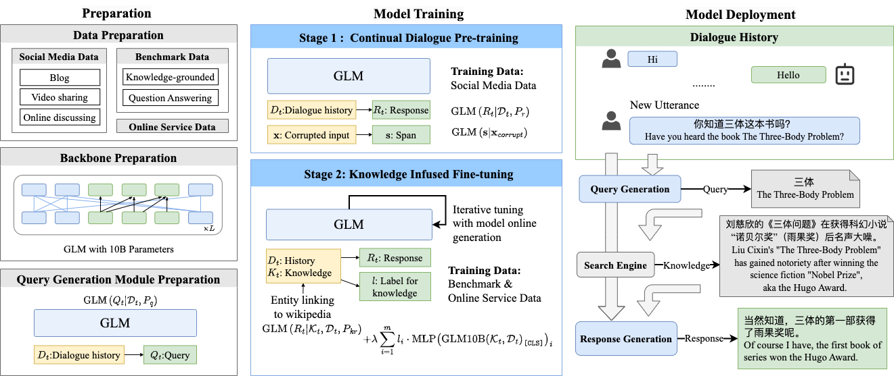

# GLM-Dialog:Noise-tolerant Pre-training for Knowledge-grounded Dialogue Generation
<p align="center">
  
</p>
GLM-Dialog is a large-scale language model (LLM) with 10B parameters capable of knowledge-grounded conversation in Chinese using a search engine to access the Internet knowledge. It is obtained by fine-tuning [GLM10B](https://github.com/THUDM/GLM), an open-source, pre-trained Chinese LLM with 10B parameter. GLM-Dialog offers 
1. a series of applicable techniques for exploiting various external knowledge including both helpful and noisy knowledge, enabling the creation of robust knowledge-grounded dialogue LLMs with limited proper datasets;
2. a novel evaluation platform for comparing the dialogue models in real-world applications;
3. a large-scale, open-source dialogue model for building downstream dialogue service;
4. an easy-to-use toolkit that consists of tools such as short text entity linking, query generation, helpful knowledge classification, as well as an online service on WeChat platform for supporting convenient usage and experience. 

## Content
1. [Requirements](#requirements)
2. [ModelCheckpoints](#model-checkpoints)
3. [Inference](#inference)
4. [Training](#training)
5. [Related-Tools](#related-tools)
6. [WeChat-Account](#wechat-account)
7. [Evaluation](#evaluation)
8. [Citation](#citation)
9. [License](#license)
10. [Contact](#contact)

### Requirements
We provide two ways to configure the environment: dockerfile configuration or manual configuration.
Clone the repo first.

```shell
git clone https://github.com/RUCKBReasoning/GLM-dialog
cd GLM-dialog
```

**Docker Image:**
We prepare a docker image based on CUDA 11.2 [docker/cuda112.dockerfile](docker/cuda112.dockerfile).
```shell
docker build -f cuda112.dockerfile . -t dailglm-cuda112
docker run --gpus all --rm -it --ipc=host dailglm-cuda112
```

**Manual Installation:**
Please first install PyTorch (we use 1.9.0) and [apex](https://github.com/NVIDIA/apex), and then install other
dependencies by `pip install -r requirements.txt`

We currently do not support multi-GPU inference. Loading the 10B model in FP16 mode requires at least 19GB of GPU memory, so please make sure you have a GPU with 24GB of memory or more, such as the RTX 3090.

### Model-Checkpoints

The trained checkpoint for our final model can be downloaded [google_drive](https://drive.google.com/drive/folders/1kEmxwFme4qUzIuUOW7kRbBGZ5e_bSipu?usp=sharing) or [pan](https://pan.baidu.com/s/1g5WZwkNJS0C8qWsrtdDAOw?pwd=4edx)
```bash
mv glm-dialog.zip model_ckpt && cd model_ckpt && unzip glm-dialog.zip
```

### Inference
```bash
cd infer && python deploy.py
```
### Training
See [train.md](train.md) for instructions.

### Related-Tools
* **[HOSMEL](https://github.com/THUDM/HOSMEL) is a hot swappable modulized entity linking toolkit for short text in Chinese**

* **The query generation module takes dialogue history as input and generates an appropriate search query, which is passed to an online search engine for retrieving dialogue-relevant knowledge snippets**
```bash
cd 
```
* **Helpful knowledge Classifier decides whether to use the external knowledge or not**
```bash
cd 
```
### WeChat-Account
We deploy GLM-Dialog as a WeChat official account named [``AI小呆爱聊天/小知呆``](https://aigc.aminer.cn/xdai/chat?xdid=%23xd%E5%B0%8F%E7%9F%A5%E5%91%86001) to enable both one-one and group conversations with it and other bots.

### Evaluation

Our model achieves promising performance by the traditional human-evaluation methods. 

**Human-evaluation on 50 chit-chat self-chat dialogues:**

| Model      | Coherence    | Informativeness | Safety       | Inspiration  | Hallucination | Engagingness | Faithfulness |
| ---------- | ------------ | --------------- | ------------ | ------------ | ------------- | ------------ | ------------ |
| CDial-GPT  | 0.860        | 0.851           | 0.913        | 0.515        | 0.291         | 0.500        | 0.473        |
| PLATO-2   | <u>1.455</u> | <u>1.438</u>    | 1.448        | <u>1.129</u> | **0.062**     | <u>1.260</u> | <u>1.220</u> |
| EVA2.0     | 1.386        | 1.336           | 1.362        | 0.902        | <u>0.068</u>  | 1.213        | 1.093        |
| GLM10B     | 1.371        | 1.296           | <u>1.539</u> | 0.932        | 0.130         | 1.187        | 1.160        |
| DialGLM10B | **1.515**    | **1.517**       | **1.656**    | **1.171**    | 0.098         | **1.383**    | **1.383**    |

**Human-evaluation on 100 knowledge-grounded self-chat dialogues:**

| Model      | Coherence    | Informativeness | Safety       | Inspiration  | Hallucination | Engagingness | Faithfulness |
| ---------- | ------------ | --------------- | ------------ | ------------ | ------------- | ------------ | ------------ |
| CDial-GPT  | 1.140        | 1.069           | 1.478        | 0.591        | 0.221         | 0.603        | 0.690        |
| PLATO-2   | <u>1.698</u> | <u>1.614</u>    | <u>1.793</u> | 1.090        | **0.032**     | 1.420        | <u>1.413</u> |
| EVA2.0     | 1.488        | 1.413           | 1.674        | 0.832        | 0.089         | 1.230        | 1.223        |
| GLM10B     | 1.513        | 1.497           | 1.669        | <u>1.157</u> | 0.093         | <u>1.460</u> | 1.340        |
| DialGLM10B | **1.759**    | **1.742**       | **1.816**    | **1.223**    | <u>0.046</u>  | **1.550**    | **1.473**    |

**Human-evaluation on 50 chit-chat human-bot chat dialogue:**

| Model      | Coherence    | Informativeness | Safety       | Inspiration  | Hallucination | Engagingness | Faithfulness |
| ---------- | ------------ | --------------- | ------------ | ------------ | ------------- | ------------ | ------------ |
| CDial-GPT  | 1.138        | 0.984           | 1.310        | 0.690        | 0.272         | 0.696        | 0.660        |
| PLATO-2   | **1.725**    | <u>1.610</u>    | <u>1.741</u> | 1.239        | **0.068**     | <u>1.392</u> | <u>1.316</u> |
| EVA2.0     | <u>1.690</u> | 1.494           | **1.743**    | 1.107        | <u>0.077</u>  | 1.312        | 1.292        |
| GLM10B     | 1.439        | 1.436           | 1.513        | <u>1.249</u> | 0.164         | 1.236        | 1.208        |
| GLM130B    | 1.232        | 1.179           | 1.378        | 1.000        | 0.257         | 0.816        | 0.784        |
| DialGLM10B | 1.660        | **1.641**       | 1.688        | **1.376**    | 0.127         | **1.440**    | **1.460**    |

**Human-evaluation on 100 knowledge-grounded human-bot chat dialogue:**

| Model      | Coherence    | Informativeness | Safety       | Inspiration  | Hallucination | Engagingness | Faithfulness |
| ---------- | ------------ | --------------- | ------------ | ------------ | ------------- | ------------ | ------------ |
| CDial-GPT  | 0.956        | 0.777           | 1.194        | 0.543        | 0.363         | 0.562        | 0.542        |
| PLATO-2   | <u>1.585</u> | 1.387           | <u>1.650</u> | 1.086        | **0.129**     | 1.244        | 1.128        |
| EVA2.0     | 1.524        | 1.275           | 1.616        | 0.961        | 0.151         | 1.150        | 1.096        |
| GLM10B     | 1.543        | <u>1.528</u>    | 1.570        | <u>1.329</u> | 0.174         | <u>1.324</u> | <u>1.282</u> |
| GLM130B    | 1.177        | 1.128           | 1.315        | 0.954        | 0.303         | 0.852        | 0.832        |
| DialGLM10B | **1.668**    | **1.624**       | **1.688**    | **1.393**    | <u>0.134</u>  | **1.412**    | **1.368**    |


**Evaluation platform:**

We also provide an implicit human evaluation strategy that enables a human to centrally converse with several dialogue models at once and implicitly compare these bots during the conversation process. 
You can access the evaluation platform [here](https://aigc.aminer.cn/racetrack), which currently includes [CDial-GPT](https://github.com/thu-coai/CDial-GPT), [EVA2.0](https://github.com/thu-coai/EVA), and [Plato2](https://arxiv.org/abs/2006.16779), [GLM10B, GLM130B](https://github.com/THUDM/GLM-130B), and GLM-Dialog for evaluation.
We release the codes for the automatic evaluation, traditional human evaluation, and the proposed implicit human evaluation at [DialEvaluation](https://github.com/RUCKBReasoning/DialEvaluation).

### Citation
If you find our work useful, please consider citing GLM-Dialog:
```
@article{ GLM-Dialog,
    title={ GLM-Dialog: Noise-tolerant Pre-training for Knowledge-grounded Dialogue Generation },
    author={ Jing Zhang, Xiaokang Zhang, Daniel Zhang-Li, Jifan Yu, Zijun Yao, Zeyao Ma, Yiqi Xu, Haohua Wang, Xiaohan Zhang, Nianyi Lin, Sunrui Lu, Juanzi Li, Jie Tang },
    year={ 2023 }
}
```

### License
NPM is CC-BY-NC 4.0 licensed.

### Contact

Please leave Github issues or contact Xiaokang Zhang `zhang2718@ruc.edu.cn` for any questions.


